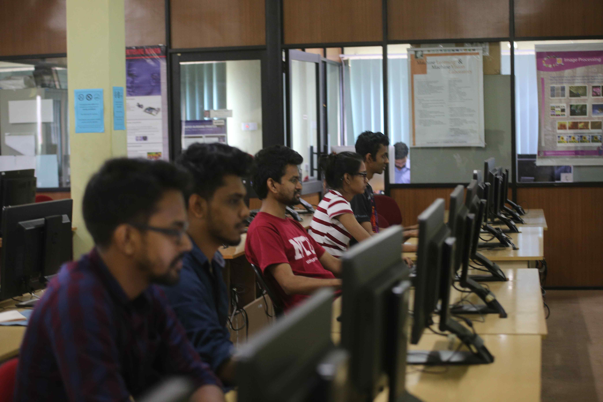

# Water Quality Monitoring And Usage Management System
In this project we are developing a water tank monitoring system for providing clean water and reduce the water wastage

Group No :13 
E/16/049      Harshana Bandara          e16049@eng.pdn.ac.lk           
E/16/134      Yasitha Herath            e16134@eng.pdn.ac.lk                 
E/16/388      Thushara Weerasundara     e16388@eng.pdn.ac.lk)      

# Problem

Water mismanagement and consumption of poluted water is a major challenge, the world is facing currently. Current market is yet to address this issue with an effective solution. The solutions that are currently present on the market are either too expensive for domestic usage or does not meet the user expectations.

# Solution

To overcome these issues, we are propossing a device which can be used to measure the water quality of the inlet of a water tank and the water level inside the tank. We expect to target both domestic user requirments and industrial user requirements by a reasonable price. User can control the device using a mobile application.

## 1.	Water quality monitoring

* TDS count – by electric conductivity of water
* Turbidity – by measuring scattering of light in water

For these 2 measurments, TDS sensors and Turbidity sensors will be used and their readings will be analyzed with ideal water quality levels and determine the water quality of the incoming water to the tank during a filling and notify the user if there is any contamination in the water. We use these 2 sensors because by using these 2 readings we can determine most of the characteristics of water.

## 2.	Water level monitoring

By using an ultrasonic sensor, water level will be monitored and when the tank is nearing to finish filling, user will be notified. We use ultrasonic sensor because of it's high accuaracy and sensor is not easily effected by water.
Also this will generate the usage reports of the water and allow user to observe the current water level in the tank if needed. This measurement also allows to rationing of water and user will be warned in case of overusage.

# Overview

# Technologies

* AVR       - AVR has a faster execution time than arduino. That will improve the reaction time of the device.
* Flutter   - For mobile application we expect to use Flutter because it is compatible with both ios and android platforms.
* mongoDB   - Since our device is based on cloud computing, mongoDB is the best choice for a database implementation.
* AWS       - AWS offers us higher security and also offers us with variety of IT services.

## [Introductory Video](https://github.com/cepdnaclk/e16-3yp-water-quality-monitoring-and-usage-monitoring-system/blob/main/video/Water%20Quality%20Monitoring%20and%20Usage%20Monitoring%20System.mp4)

# Advising Lecturers

   1. Dr. Isuru Navinna
   2. Dr. Ziyan Marikkar

# [University Of Peradeniya](https://www.pdn.ac.lk/uop/directory/index.php)

# [Faculty Of Engineering](http://eng.pdn.ac.lk/)

# [Department Of Computer Engineering](http://www.ce.pdn.ac.lk/)

